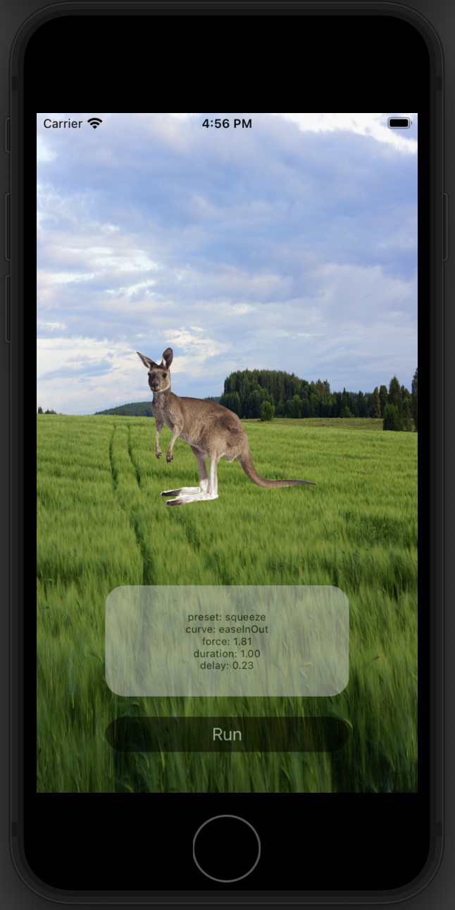

# Animations

Приложение с применением анимации.

# Интерфейс
1. Экран содержит картинку (кунгуру) к которой применяется анимация в результате нажатия на кнопку "Run".
Лейбл отображает информацию по текущей примененной анимации.
Кнопка, после первого нажатия, отображает название следующей анимации, которая будет применена к картинке.

# Используемый стек технологий
- Язык программирования - `Swift`
- Архитектура - `MVC`
- Интерфейс - `UIKit`
- Менеджер зависимостей - 'CocoaPods'
- Сторонний фреймворк - 'Spring'
- iOS 13+
